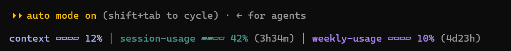

# compact-usage-meter

A Claude Code mod that shows, on a row under the prompt's hint line:

- **model**: the model and its effort, e.g. `Sonnet 5.5 (xhigh)`, and, when you pay per token (an API key or a cloud provider), the session's cost so far, e.g. `$1.23`, as `/cost` totals it. On a subscription the cost is hidden: it is a list-price estimate, not a bill. The model and effort update as soon as you change them with `/model` or `/effort <level>`; otherwise the effort appears after the first turn.
- **context**: how full the conversation's context window is
- **session**: your 5-hour usage limit, with the time until it resets
- **weekly**: your 7-day usage limit, with the time until it resets



Each meter has its own color. A percentage turns yellow from 50% and red above 80%, and you get a toast when a limit reaches 80% and 95%. The countdowns refresh once a minute.

On narrow terminals and split panes, the row steps down to shorter forms. First the model line goes, then the bars shrink, then they're dropped, then the reset times, and finally only context is left.

## Install

In Claude Code, run:

```
/plugin install compact-usage-meter --marketplace https://github.com/dkoh0207/compact-usage-meter.git
```

The short form `--marketplace dkoh0207/compact-usage-meter` works too.

To try it for one session without installing, clone the repository and start Claude Code with it:

```
git clone https://github.com/dkoh0207/compact-usage-meter.git
claude --plugin-dir compact-usage-meter
```

## Settings

These constants are at the top of the files in `hooks/`:

| Constant | File | What it does |
| --- | --- | --- |
| `GAP` | `register.tsx` | Blank rows between the hint line and the meter (default `1`) |
| `GLYPHS` | `format.ts` | `'blocks'` draws `▰▱`; `'ascii'` draws `#-` for fonts that render the blocks badly |
| `DIVIDER` | `format.ts` | `'bar'` puts `│` between the meters (default); `'dot'` puts a center-dot `·` there |
| `AMBIGUOUS_WIDTH` | `format.ts` | Set to `2` if your locale draws `▰▱` double-width (some East Asian setups) |

## Development

```
claude plugin validate .
claude plugin test .
```
